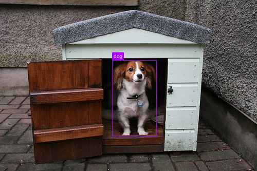
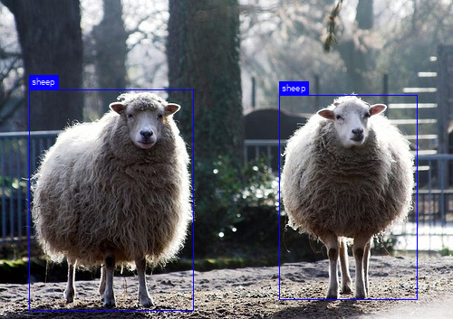
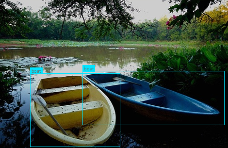

# YOLOnaut
In this work, we explore different YOLO versions for object detection, both to
get intimately familiar with the architectures and implementation peculiarities,
but also the intuition behind the underlying ideas. Then, we implement them from
scratch and in a way that makes them easy to understand, run and deploy.

### YOLOv1
Implementation following the original [paper](https://arxiv.org/abs/1506.02640)
by Redmon, Divvala, Girshick and Farhadi; with
[ResNet](https://arxiv.org/abs/1512.03385) (50) backbone. All the system
parameters are as in the paper, i.e. $C=20$, $S=7$ and $B=2$; and the dataset
used is [VOC PASCAL 2012](http://host.robots.ox.ac.uk/pascal/VOC/voc2012/).

To download the dataset, one can simply run:
```python
from torchvision.datasets import VOCDetection
VOCDetection(download_directory, '2012', download=True)
```

In ```preprocess_data.py``` script, several functions are implemented to
transform the initial dataset into different formats one can use for training
with different architectures. In current implementation, each image data is
converted into a ```torch.Tensor``` of shape ```(S, S, C + 5 * B)```, and then
stacked in batches during training, and fed directly to the loss function.
Although the parameters ```S```, ```C``` and ```B``` are equal to ones in the
paper, implementation is general and valid for arbitrary values, which can be
set inside the ```config.py``` configuration file.

The loss function is implemented close to the original paper form, using binary
masks $\mathbf 1_{\text{obj}\_i}$, $\mathbf 1_{\text{obj}\_ij}$ and
$\mathbf 1_{\text{noobj}\_ij}$. Several peculiarities of this function, such as
issues with nondifferentiability and selection of responsible predictions, are
outllined in code.

After the initial implementation and debugging, we overfit the network on $1$
image and then a $100$ images, yielding the following expected results (since
overfitting is the aim here, we temporarily remove the ```Dropout``` layer from
the network):

  |  
:-:|:-:
  |  
---

### YOLOv2
This implementation is a reduced version of the architecture from the original
[paper](https://arxiv.org/abs/1612.08242) by Redmon and Farhadi, for purposes of
easier deployment (e.g. to a portable camera or a webcam for demonstrations and
applications). There are several nontrivial improvements in YOLOv2 compared to
YOLOv1, such as the use of batch normalization, high resolution classifier
network as a backbone, anchor boxes selected by $k$-means, etc. , all of which
allow for more robust object localization, better generalization and faster
training and inference.

Loss function is similar to the one in YOLOv1, with some elaborate changes, but
can easily be debugged by training only the final layers of the
[pretrained](https://pjreddie.com/) network on a smaller dataset, possibly with
inclusion of specific loss terms only (along with the usual overfitting tests
which were done for YOLOv1).

### YOLOv5


## Acknowledgements
We are grateful to the PSIML crew for the opportunity to work on this project
and mentors from Microsoft and Everseen for their guidance and support.

This project uses the Roboto font, which is developed by Google. The font is
licensed under the Apache License, Version 2.0. You may obtain a copy of the
License at http://www.apache.org/licenses/LICENSE-2.0.
