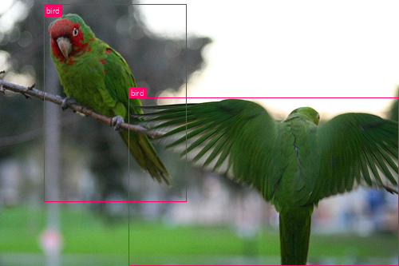

# YOLOnaut
Explore different YOLO versions for object detection, both to get intimately
familiar with the architecture and underlying ideas and to implement it in a way
that is easy to use and deploy.

### YOLOv1
Implementation following the original [paper](https://arxiv.org/abs/1506.02640)
by Redmon, Divvala, Girshick and Farhadi; with
[ResNet](https://arxiv.org/abs/1512.03385) (50) backbone. All the system
parameters are as in the paper, i.e. $C=20$, $S=7$ and $B=2$; and the dataset
used is [VOC PASCAL 2012](http://host.robots.ox.ac.uk/pascal/VOC/voc2012/).

To download the dataset, one can simply run:
from torchvision.datasets import VOCDetection
```python
VOCDetection(download_directory, '2012', download=True)
```

In ```preprocess_data.py``` script, several functions are implemented to
transform the initial dataset into the format one can use for training. In
current implementation, each image data is converted into a ```torch.Tensor```
of shape ```(S, S, C + 5 * B)```, and then stacked in batches during training,
and fed directly to the loss function. Although the parameters ```S```, ```C```
and ```B``` are equal to ones in the paper, implementation is general and valid
for arbitrary values.

The loss function is implemented close to the original paper form, using binary
masks $\mathbf 1_{\text{obj}\_i}$, $\mathbf 1_{\text{obj}\_ij}$ and
$\mathbf 1_{\text{noobj}\_ij}$. Several peculiarities of this function, such as
issues with nondifferentiability and selection of responsible predictions, are
outllined in code.

After the initial implementation and debugging, we overfit the network on $1$
image and then $100$ images, yielding the following expected results (since
overfitting is the aim here, we temporarily remove the dropout layer from the
network):

<style>
td, th {
   border: none!important;
}
</style>

  |  
:-:|:-:
  |  
---

## Acknowledgements
This project uses the Roboto font, which is developed by Google. The font is
licensed under the Apache License, Version 2.0. You may obtain a copy of the
License at http://www.apache.org/licenses/LICENSE-2.0.